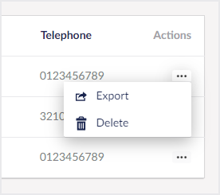

# Action Visibility

By default actions are not visible in the UI and you must expressly define when and were an action should display. This can be achived in two ways, either on the action definition itself or at the point of registration on the collections config.

## Controlling the default action visibility

To define the default visbility of an action at the action level you can do this by overriding the `IsVisible` method of the `KonstruktAction<>` base class.

````csharp
// Example
public class MyAction : KonstruktAction<KonstruktActionResult>
{
    ...
    public override bool IsVisible(KonstruktActionVisibilityContext ctx)
    {
        return ctx.ActionType == KonstruktActionType.Bulk 
            || ctx.ActionType == KonstruktActionType.Row;
    }
    ...
}
````

The `IsVisible` method is passed a `KonstruktActionVisibilityContext` which you should use to decide whether the action should display, returning `true` if it should, or `false` if it should not. See [Action visibility context](#action-visibility-context) bellow for more info.

## Overriding an actions visibility

Overriding an actions visibility is controlled via the [collections](../collections/overview.md) configuration.

#### **AddAction&lt;TMenuActionType&gt;(Lambda actionConfig = null) : KonstruktCollectionConfigBuilder&lt;TEntityType&gt;**

Adds an action of the given type to the collection with the given visibility.

````csharp
// Example
collectionConfig.AddAction<ExportMenuAction>(actionConfig => actionConfig
    .SetVisibility(x => x.ActionType == KonstruktActionType.Bulk 
        || x.ActionType == KonstruktActionType.Row)
);
````

#### **AddAction(Type actionType, Lambda actionConfig = null) : KonstruktCollectionConfigBuilder&lt;TEntityType&gt;**

Adds an action of the given type to the collection with the given visibility.

````csharp
// Example
collectionConfig.AddAction(typeof(ExportMenuAction), actionConfig => actionConfig
    .SetVisibility(x => x.ActionType == KonstruktActionType.Bulk 
        || x.ActionType == KonstruktActionType.Row)
);
````

#### **AddAction(IKonstruktAction action, Lambda actionConfig = null) : KonstruktCollectionConfigBuilder&lt;TEntityType&gt;**

Adds the given action to the collection with the given visibility.

````csharp
// Example
collectionConfig.AddAction(action, actionConfig => actionConfig
    .SetVisibility(x => x.ActionType == KonstruktActionType.Bulk 
        || x.ActionType == KonstruktActionType.Row)
);
````

## Action visibility context

When controlling the visibility of an action you will be given a `KonstruktActionVisibilityContext` object from which you can decide whether to show the action or not. The visibility context contains two key pieces of information on which you can base this decision.

### ActionType

The action type property is an enum property that define which area of the UI it is that wishes to access this action. Enabling an action to display for a given action type will determine where an action is displayed.

#### ContainerMenu

The `ContainerMenu` action type determines that the action will be displayed in both the tree of the collection as well as it's list view actions menu.


#### EntityMenu

The `EntityMenu` action type determines that the action will be displayed in the actions menu of a collection editor UI.


#### Bulk

The `Bulk` action type determines that the action will be displayed in the collection list view bulk actions menu.


#### Row

The `Row` action type determines that the action will be displayed in the collection list view action row menu.



### UserGroups

The user groups collection contains a list of Umbraco `IReadOnlyUserGroup` objects for the current logged in back office user and allows you to control the visibility of actions for given user group members.