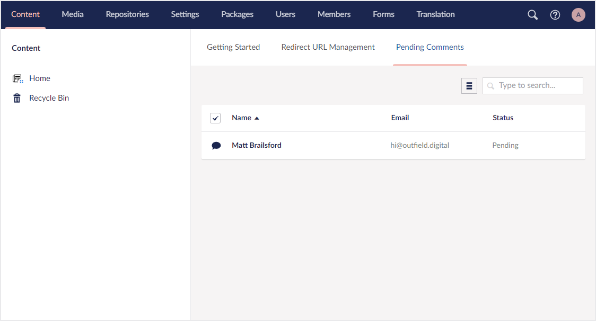

# Dashboards

A dashboard is a view that is displayed at the root of a section and usually contains welcome information and/or useful tools relevant to the given section. When there are multiple dashboards to display in a section these are usually presented in a tabbed layout to allow you to swich between the different dashboard views.



## Defining a dashboard

You define a dashboard by calling one of the `AddDashboard` methods on the root level `KonstruktConfigBuilder` instance.

#### **AddDashboard(string name, Lambda dashboardConfig = null) : KonstruktDashboardConfigBuilder**

Adds a dashboard with the given name.

```csharp
// Example
config.AddDashboard("Team", dashboardConfig => {
    ...
});
```


#### **AddDashboardBefore(string beforeAlias, string name, Lambda dashboardConfig = null) : KonstruktDashboardConfigBuilder**

Adds a dashboard with the given name before the dashboard with the given alias.

```csharp
// Example
config.AddDashboardBefore("contentIntro", "Team", dashboardConfig => {
    ...
});
```

#### **AddDashboardAfter(string afterAlias, string name, Lambda dashboardConfig = null) : KonstruktDashboardConfigBuilder**

Adds a dashboard with the given name after the dashboard with the given alias.

```csharp
// Example
config.AddDashboardAfter("contentIntro", "Team", dashboardConfig => {
    ...
});
```

## Changing a dashboard alias

#### **SetAlias(string alias) : KonstruktDashboardConfigBuilder**

Sets the alias of the dashboard.

**Optional:** When adding a new dashboard, an alias is automatically generated from the supplied name for you, however you can use the `SetAlias` method to override this should you need a specific alias.

```csharp
// Example
dashboardConfig.SetAlias("team");
```

## Changing when a dashboard should display

Changing when a dashboard is displayed is controlled via an inner config. Options on the inner config are `ShowInSection` to control which sections a dashboard displays in and `ShowForUserGroup` and `HideForUserGroup` to control the visibility of the dashboard for given user groups. You can call these config methods multiple times to add multiple section/role configurations.

#### **SetVisibility(Lambda visibilityConfig) : KonstruktDashboardConfigBuilder**

Sets the dashboard visibility config. 

````csharp
// Example
dashboardConfig.SetVisibility(visibilityConfig => visibilityConfig
    .ShowInSection("content")
    .ShowInSection("media")
    .ShowForUserGroup("admin")
    .HideForUserGroup("translator")
);
````

## Setting the collection of a dashboard

Dashboards are only able to display a single collection. If you need to display multiple collections, then you need to configure multiple dashboards.

#### **SetCollection&lt;TEntityType&gt;(Lambda idFieldExpression, string nameSingular, string namePlural, string description, Lambda collectionConfig = null) : KonstruktContextAppConfigBuilder**

Sets the collection of the current dashboard with the given names and description and default icons. An ID property accessor expression is required so that Konstrukt knows which property is the ID property. See the [Collections documentation](../collections/overview.md) for more info.

```csharp
// Example
dashboardConfig.SetCollection<Comment>(p => p.Id, p=> "Team Member", "Team Members", "A collection of team members", collectionConfig => {
    ...
});
```

#### **SetCollection&lt;TEntityType&gt;(Lambda idFieldExpression, Lambda fkFieldExpression, string nameSingular, string namePlural, string description, string iconSingular, string iconPlural, Lambda collectionConfig = null) : KonstruktContextAppConfigBuilder**

Sets the collection of the current dashboard with the given names, description and icons. An ID property accessor expression is required so that Konstrukt knows which property is the ID property. See the [Collections documentation](../collections/overview.md) for more info.

```csharp
// Example
dashboardConfig.SetCollection<Comment>(p => p.Id, "Team Member", "Team Members", "A collection of team members", "icon-umm-user", "icon-umb-user", collectionConfig => {
    ...
});
```